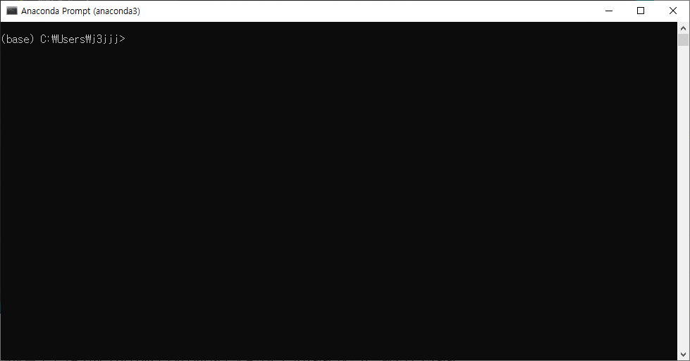
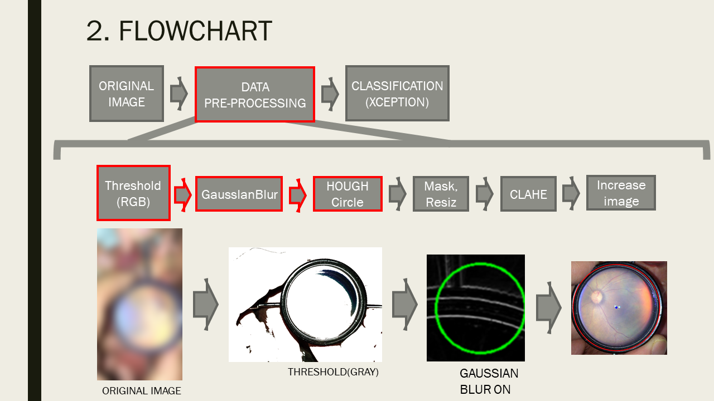
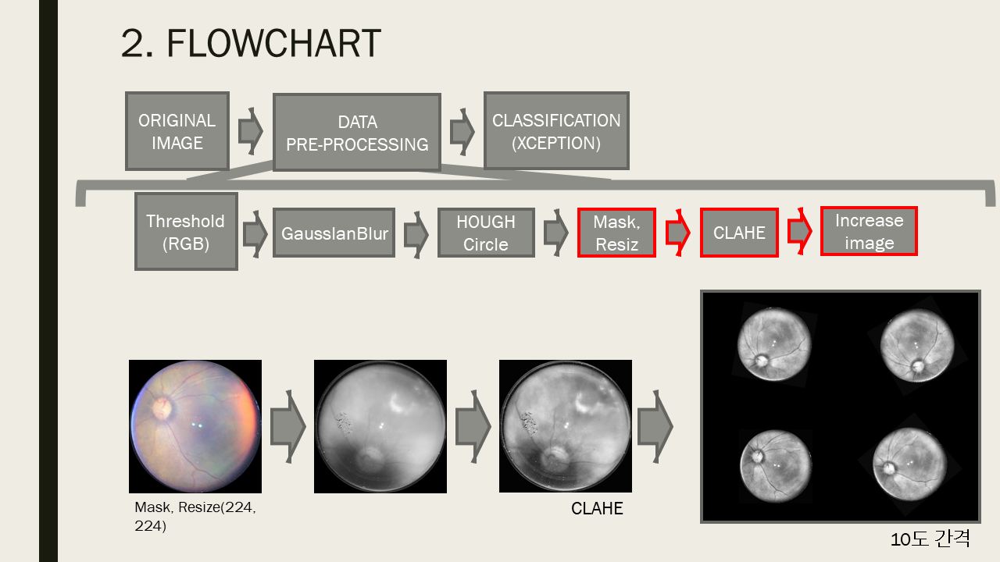
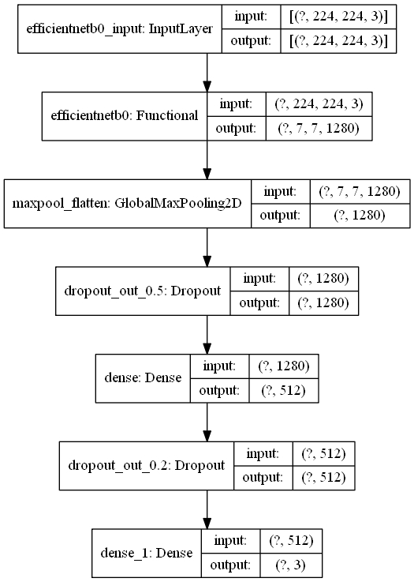
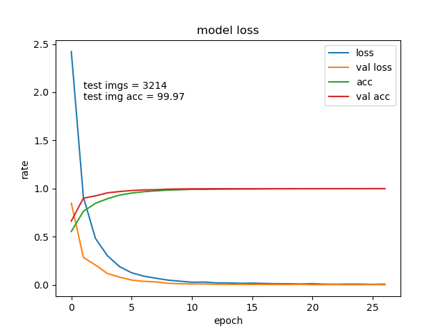

# fundus
안저 이미지 사진에서 정상, 중간, 비정상분류

## 개요
본 시스템은 크게 2가지 단계로 이루어져 있습니다.
1. Pre-processing  
스마트 폰 카메라로 촬영한 사진으로부터 렌즈영역을 찾아낸뒤 전처리
2. Classification  
전처리된 안저사진을 딥러닝 모델을 통해 확인

## 모듈 설치
프로그램을 실행하기 위해서는 python 3.x(3.7권장)과 함께 다음의 라이브러리가 필요합니다
* tensorflow (<=2)
* opencv-python
* numpy
* matplotlib
* tqdm

1. anaconda prompt에서 원하는 폴더로 이동하는 방법
(예를 들어 C:\Users\j3jjj에서 C:\Users\j3jjj\Desktop\pj\딥러닝 세미나로 이동하는 법)


---
cd .. : 이전으로 이동  
cd [원하는 폴더명] : 원하는 폴더로 이동  
dir : 현재 디렉토리의 폴더, 파일 리스트  

---
2. anaconda prompt에서 다음과 같이 입력(requirements.txt의 모듈 설치)
```
pip install -r requirements.txt
```

## 디렉토리 구조
```
.
├── train/
├── pred_train/
├── input/
├── output/
└── checkpoint/
```

| 폴더 | 설명 |
| -------- | ----------- |
| `train/` | 학습하기 위한 이미지 저장 |
| `pred_train/` | 전처리를 한 뒤 이미지 저장 |
| `input/` | test하고 싶은 이미지 저장 |
| `output/` | test이미지에 대한 결과를 csv로 저장 |
| `checkpoint/` | 학습이 끝난 뒤 loss가 가장 낮은 가중치를 저장 |


## 구조
1. 전처리


(이미지를 회전하여 1장의 이미지를 36장으로 만들어줍니다)   
-train: train폴더에 있는 이미지를 위와 같은 방법으로 처리합니다   
-test: input폴더에 있는 이미지를 위와 같은 방법으로 처리합니다   

2. classification model

Base Network로는 최근에 주목받는 EfficientNet중에서 경량화된 EfficientNet B0를 사용합니다    
extra layer로는 dense와 dropout을 추가했습니다  

## 성능

Traning 이미지와 Validation 이미지, test 이미지를 0.63, 0.27, 0.1로 나누어 학습과 검증을 100 epoch 진행하였으며, 학습 중 Validation loss가 3번 연속으로 떨어지지않을 때 정지한 결과입니다.  
또한 test 이미지를 통해 데이터에 대한 범용성을 가지는지 확인했습니다  

## 실행
다음과 같이 프로그램을 실행 합니다  
```
$ python classifier.py
```
입력 이미지는 input/폴더에 있어야 합니다   

## 결과
![result]](./img/result.png)
| 라벨 | 설명 |
| -------- | ----------- |
| image name | 이미지 이름 |
| classifier | 1장을 여러장으로 증폭한 뒤 가장 많았던 class |
| Accuarcy | 가장 많았던 class의 확률 |
